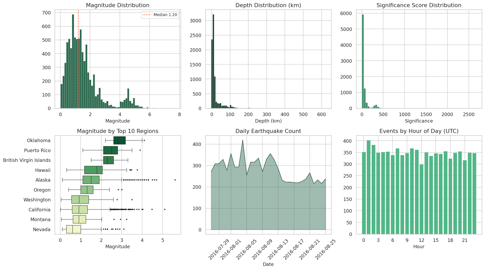
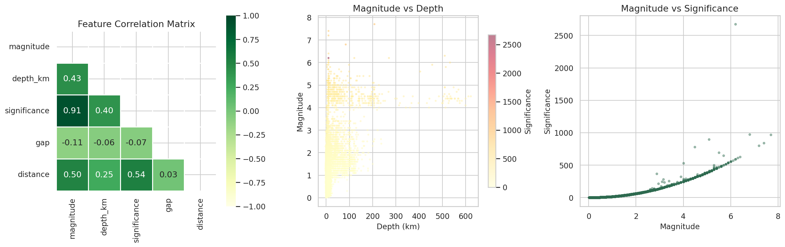
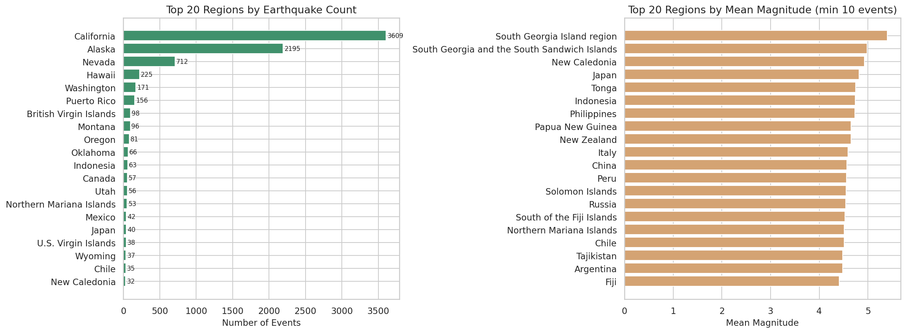

# Kaggle Notebooks

A collection of my Kaggle notebooks showcasing data analysis, machine learning, and visualization skills.

---

## Featured Work

### Global Earthquake Patterns EDA

Comprehensive analysis of ~8,400 seismic events across 118 regions, featuring magnitude distributions, depth analysis, regional patterns, and temporal trends.

| | |
|---|---|
|  |  |

[View Full Notebook on Kaggle](https://www.kaggle.com/code/awallay/global-earthquake-patterns-eda) | [GitHub](eda/global-earthquake-patterns/global-earthquake-patterns-eda.ipynb)

---

## Computer Vision

### Jaguar Re-Identification Competition

Wildlife conservation ML - identifying individual jaguars from camera trap images using deep learning.

| Notebook | Score | Kaggle |
|----------|-------|--------|
| [Jaguar Re-ID: 0.93 Score](jaguar-competition/jaguar-re-identification-0-93-score/jaguar-re-identification-0-93-score.ipynb) | **0.93** | [View](https://www.kaggle.com/code/awallay/jaguar-re-identification-0-93-score) |
| [3-Model Ensemble (EVA02 + MegaDescriptor)](jaguar-competition/jaguar-re-id-3-model-ensemble/jaguar-re-id-3-model-ensemble-eva02-megadescri.ipynb) | - | [View](https://www.kaggle.com/code/awallay/jaguar-re-id-3-model-ensemble-eva02-megadescri) |
| [DINOv2 + ArcFace Pipeline](jaguar-competition/jaguar-re-id-dinov2-arcface/jaguar-re-id-dinov2-arcface-pipeline.ipynb) | - | [View](https://www.kaggle.com/code/awallay/jaguar-re-id-dinov2-arcface-pipeline) |
| [Spot Pattern Recognition](jaguar-competition/jaguar-re-id-spot-pattern/jaguar-re-id-spot-pattern-recognition-model.ipynb) | - | [View](https://www.kaggle.com/code/awallay/jaguar-re-id-spot-pattern-recognition-model) |

---

## Exploratory Data Analysis

| Notebook | Description | Kaggle |
|----------|-------------|--------|
| [Netflix Content Analysis](eda/whats-really-on-netflix/whats-really-on-netflix.ipynb) | What's really streaming? Content trends and patterns | [View](https://www.kaggle.com/code/awallay/whats-really-on-netflix) |
| [Precious Metals 2016-2026](eda/precious-metals-decoded/precious-metals-decoded-2016-2026-eda.ipynb) | Gold, silver, platinum price analysis | [View](https://www.kaggle.com/code/awallay/precious-metals-decoded-2016-2026-eda) |
| [TikTok Video Analysis](eda/tiktok-video-analysis/tik-tok-video-duration-key-phrase-analysis.ipynb) | Duration patterns & key phrase extraction | [View](https://www.kaggle.com/code/awallay/tik-tok-video-duration-key-phrase-analysis) |
| [Student Social Media Addiction](eda/student-social-media-addiction/student-social-media-addiction-from-correlation-t.ipynb) | Correlation to causation study | [View](https://www.kaggle.com/code/awallay/student-social-media-addiction-from-correlation-t) |
| [Doom Scrolling Analysis](eda/doom-scrolling-analysis/doom-scrolling-analysis.ipynb) | Behavioral patterns in endless scrolling | [View](https://www.kaggle.com/code/awallay/doom-scrolling-analysis) |
| [Same Hours, Different Lives](eda/same-hours-different-lives/same-hours-different-lives-eda.ipynb) | Time usage comparison study | [View](https://www.kaggle.com/code/awallay/same-hours-different-lives-eda) |
| [Ecommerce Dataset](eda/ecommerce-dataset/ecommerce-dataset-eda.ipynb) | Online shopping patterns | [View](https://www.kaggle.com/code/awallay/ecommerce-dataset-eda) |
| [Alcohol & Academic Performance](eda/alcohol-consumption-grades/alcohol-consumption-and-average-grades.ipynb) | Consumption vs. grades correlation | [View](https://www.kaggle.com/code/awallay/alcohol-consumption-and-average-grades) |
| [Check this Out EDA](eda/check-this-out/check-this-out-eda.ipynb) | Retail checkout analysis | [View](https://www.kaggle.com/code/awallay/check-this-out-eda) |

---

## Machine Learning / Prediction

| Notebook | Description | Kaggle |
|----------|-------------|--------|
| [Heart Disease Prediction](ml-prediction/heart-disease-ensemble/heart-disease-pred-ensemble-gbt.ipynb) | Ensemble GBT classifier | [View](https://www.kaggle.com/code/awallay/heart-disease-pred-ensemble-gbt) |
| [Steam Player Count Forecasting](steam-analysis/predicting-steam-player-counts/predicting-steam-player-counts-with-ml.ipynb) | Time series prediction | [View](https://www.kaggle.com/code/awallay/predicting-steam-player-counts-with-ml) |
| [Used Car Price Prediction](ml-prediction/used-car-prices/ps4e9-used-car-prices.ipynb) | Regression modeling (PS4E9) | [View](https://www.kaggle.com/code/awallay/ps4e9-used-car-prices) |
| [Barista Bench](ml-prediction/barista-bench/barista-bench-attempt.ipynb) | Competition attempt | [View](https://www.kaggle.com/code/awallay/barista-bench-attempt) |

---

## Steam Gaming Analysis

| Notebook | Description | Kaggle |
|----------|-------------|--------|
| [Steam EDA](steam-analysis/steam-eda/steam-eda.ipynb) | Comprehensive platform analysis | [View](https://www.kaggle.com/code/awallay/steam-eda) |
| [Animated Visualizations](steam-analysis/steam-animated-visualizations/steam-animated-visualizations.ipynb) | Dynamic data storytelling | [View](https://www.kaggle.com/code/awallay/steam-animated-visualizations) |

---

## Tutorials

| Notebook | Kaggle |
|----------|--------|
| [Get Started Here](tutorials/get-started-here/get-started-here.ipynb) | [View](https://www.kaggle.com/code/awallay/get-started-here) |

---

## Quick Links

- **Kaggle Profile**: [kaggle.com/awallay](https://www.kaggle.com/awallay)
- **GitHub Profile**: [github.com/auswallace](https://github.com/auswallace)

---

*Click "View" links to see notebooks with fully rendered outputs and interactive visualizations on Kaggle.*
